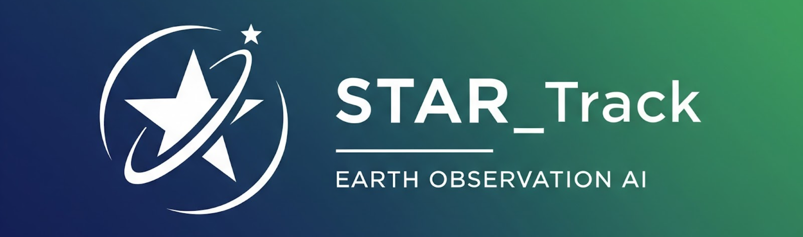

# STAR_track

## Overview
**STAR_track** (S&T Automated Running & Tracking) is an automated, highly-configurable framework for deep learning applied to geospatial and Earth observation data. It enables fast prototyping, training, evaluation, and large-scale inference of ML models on satellite and remote sensing imagery. The framework builds on PyTorch Lightning, TorchGeo, and MLflow, providing powerful experiment tracking, reproducibility, and spatially-aware data handling.

Key features include:

- Flexible model factory supporting backbone selection and checkpoint loading.
    
- Unified trainer and tester workflows with dynamic config overrides.
    
- Integration with MLflow and TensorBoard for metric, parameter, and artifact logging.
    
- Advanced visualization and logging of multi-channel inputs, predictions, and masks.
    
- Modular dataset handling with TorchGeo for geophysical use cases.

  

## Installation

Clone the repo and install dependencies:

```
git clone https://gitlab.com/stcorp/libraries/startrack.git
cd startrack
```


### Using uv for environment management (optional: skip to 'Only using pip' if not interested)

It is preferred to create an environment where you can install dependencies  and a specific python version and run the project freely to have a smoother operation since the combination of torchgeo and mlflow requires python 3.11 or later. You can do that easily with uv:

Install uv if you don't have it:

```
curl -LsSf https://astral.sh/uv/install.sh | sh
```

Inside the startrack directory, create an environment, and activate it:

```
uv venv --python 3.11
source .venv/bin/activate
```

Install requirements with uv and pip (much faster than only using pip):

```
uv pip install -r requirements.txt
```

### Only using pip:

It is preferred to use **python 3.11** for the combination of torchgeo and mlflow:

```
pip install -r requirements.txt
```

## Usage

To run the trainer directly (default config and default params), you can simply:

```
python trainer.py
```

To modify the config or create a new config file, navigate to configs/<config_name>.yaml, edit the parameters you want, then run the trainer with the intended config file using the --config option:

```
python trainer.py --config ./configs/<config_name>.yaml 
```

To modify parameters from the command line, (overriding existing parameters in the config), use the --override option and the dot notation to specify the parameter you want to change:

```
python trainer.py --config ./configs/<config_name>.yaml --override training.batch_size=10
```

To specify the device you want to use, add it to the start of the command using CUDA_VISIBLE_DEVICES:

```
CUDA_VISIBLE_DEVICES=0 python trainer.py --config ./configs/<config_name>.yaml --override training.batch_size=10
```

## Tracking Experiments

Startrack uses MLFlow and Tensorboard to track experiments and log and monitor metrics and values. 

To see tracked experiments with MLFlow, run the mlflow server (from inside the startrack directory) using:

```
mlflow ui
```

Then go to http://127.0.0.1:5000/ to see the automatically logged experiments and metrics :)

